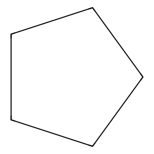

# LLM que gera scaffolds/fingerprints a partir de indicações

### Resultados
No resultado obtido pelo nosso melhor modelo ScaffoldLLM  para a indicação Hypertension, a molécula que apareceu como correspondente foi o ciclopentano, representado pelo SMILES C1CCCC1. O índice de similaridade de Tanimoto encontrado foi de 66,67%, o que mostra que existe uma correspondência moderada entre a molécula sugerida pelo modelo e as estruturas já conhecidas e registradas para essa indicação. Em termos de interpretação, esse nível de similaridade significa que a molécula compartilharia algumas características estruturais relevantes com compostos usados em hipertensão, mas ainda não se trata de um alinhamento completo.
Esse tipo de resultado segundo as imagens, é importante porque indica que o modelo conseguiu capturar padrões químicos que o aproximam de soluções já exploradas na literatura ou em bancos de dados, mas também sugere espaço para melhorias. Uma similaridade acima de 0,5 já pode ser vista como promissora em tarefas de busca por scaffolds e candidatos iniciais, já que mostra a presença de blocos estruturais recorrentes. Entretanto, valores inferiores a 0,8 apontam que ainda há diferenças significativas, o que pode abrir tanto a possibilidade de variações químicas interessantes (moléculas novas com potencial de atividade) quanto a necessidade de ajustes no processo de geração para alcançar estruturas mais próximas dos fármacos de referência.

</img>

